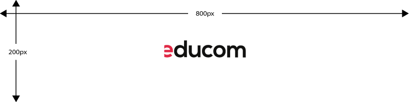

# Educom PHP cursus

Deze repository bevat mijn uitvoering van de opdrachten voor de [PHP cursus van M@nKind](https://cursus.man-kind.nl/AJAX/page/4), uitgevoerd in het kader van mijn traineeship bij [Educom](https://edu-deta.com/)

## Technologieën

*Beschrijf kort wat de achterliggende gedachte is van de gebruikte technologieen. Bijvoorbeeld: "De front-end applicatie is geschreven in React Native en middels een Restful API wordt de data uit een PHP/Symfony backend opgehaald."*

* PHP
* HTML
* CSS
* MySQL
* Apache

*Beschrijf naast de kale opsomming ook je "wapenfeiten" - bijvoorbeeld: "Ik heb een observer pattern toegepast om de workflow van het aanmaken van een gebruiker flexibeler te kunnen implementeren."*

## Methoden & Technieken

## Meer informatie

## Andere projecten
